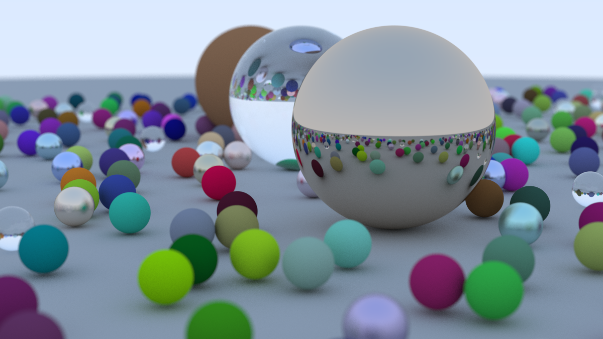

# RayTracingInOneWeekend
A rust implementation version of RayTracingInOneWeekend.

Include complete code and output ppm file for each chapter and section.

# Preview

Final output (image_width = 1200, sample_per_pixel = 500, max_depth = 50)



# Description

example: 
```
cargo run --bin raytracing  --release
```

You can replace "raytracing" with chapter2-2, chapter4-2 etc to get corresponding `output.ppm` files.

# Reference
* [Ray Tracing In One Weekend](https://raytracing.github.io/books/RayTracingInOneWeekend.html) by Peter Shirley
* [Raytracing in Rust](https://www.youtube.com/watch?v=6D8WVYm1YwY) on YouTube
